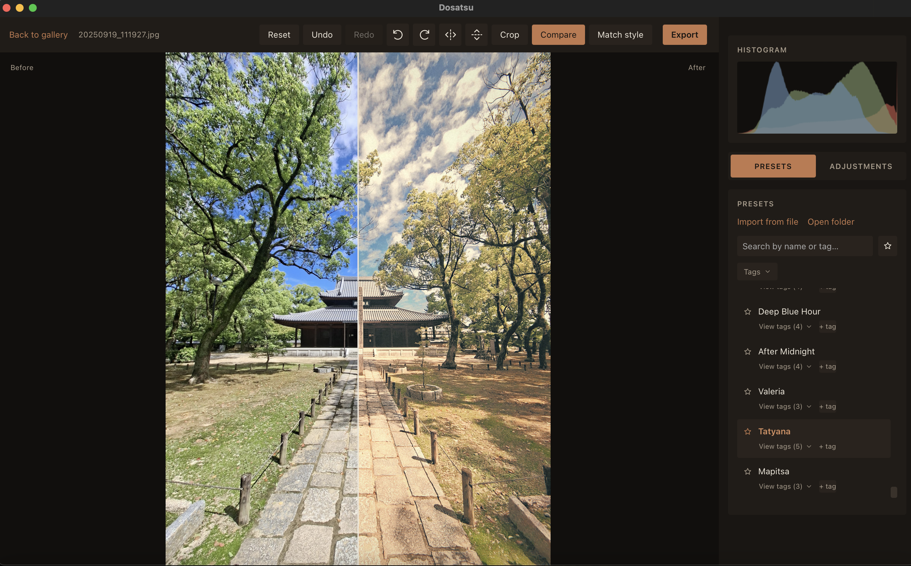
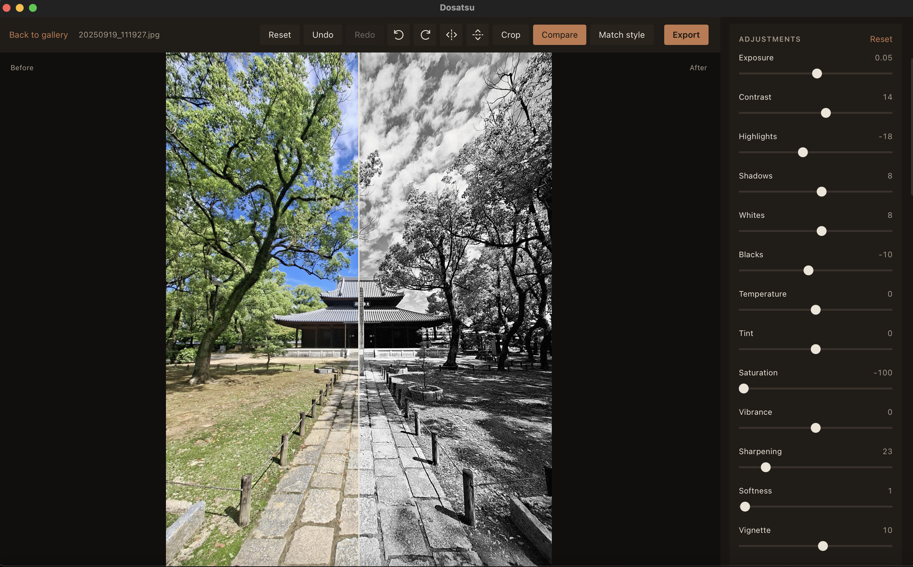
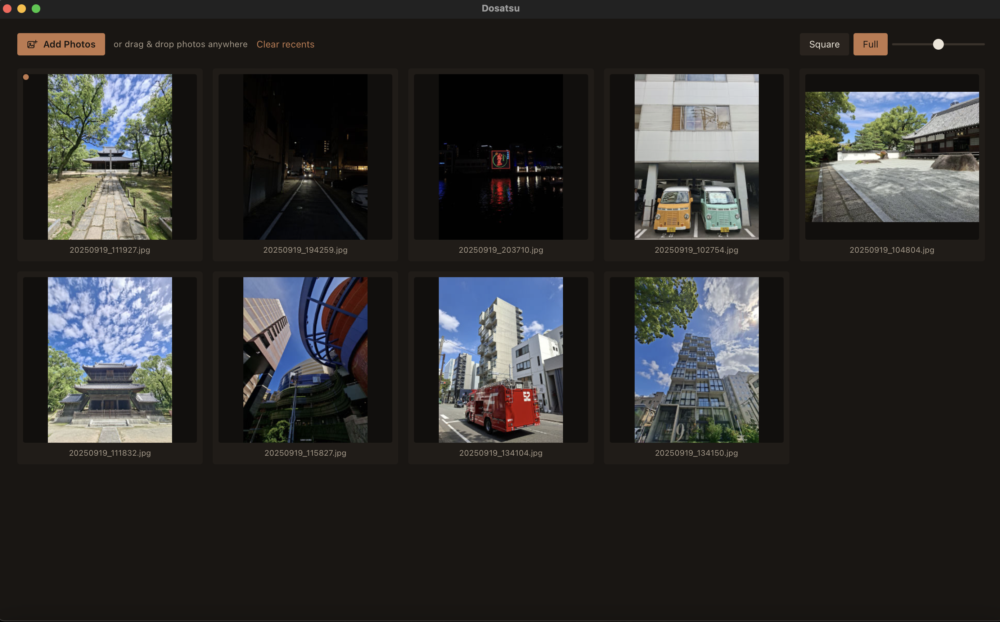

<h1 align="center">Dosatsu</h1>
<p align="center">
  
</p>

A Lightroom-style photo editor. React + TypeScript UI, Rust image processing engine, packaged as a native desktop app (macOS/Windows/Linux) with [Tauri](https://tauri.app).





## Architecture

- `src/` — React/TypeScript UI: gallery, editor, adjustment sliders, presets, export dialog.
- `src-tauri/src/engine/` — Rust image engine:
  - `adjustments.rs` (`image` + `rayon`): exposure, contrast, highlights/shadows, whites/blacks,
    temperature/tint, saturation/vibrance, sharpening, vignette.
  - `geometry.rs`: 90° rotation, horizontal/vertical flip, normalized-rectangle cropping.
  - `histogram.rs`: per-channel + luminance 256-bin histogram of the rendered image.
  - `raw.rs`: RAW file decoding (Canon/Nikon/Sony/Fuji/Panasonic/Olympus/Pentax/DNG/etc.) via
    `rawloader` + `imagepipe`, so RAW files can be opened, previewed, and exported like any other photo.
  - `io.rs` / `presets.rs`: thumbnail/preview generation, full-resolution export, JSON-file-backed presets.
- Live preview works by caching a downscaled "working copy" of the open image in Rust (RAW files are
  demosaiced once), re-applying geometry + color edits and re-encoding a JPEG preview — plus a
  histogram of the result — on every (debounced) slider change. Full-resolution processing only
  happens on export.
- The editor also supports crop (drag-to-draw, in the toolbar's Crop mode), quick 90° rotate/flip,
  and a before/after comparison slider (fetches the untouched original preview once per image).

## Development

```bash
npm install
npm run tauri dev
```

## Building installers

```bash
npm run tauri build
```

Run this on macOS to produce a `.app`/`.dmg`, and on Windows to produce an `.msi`/`.exe` installer.
Tauri's bundler targets the OS you build on, so cross-platform installers require building on (or
CI runners for) each target OS.

## Building for Android

Requires [Android Studio](https://developer.android.com/studio) (for the SDK/NDK) and the Android
Rust targets:

```bash
rustup target add aarch64-linux-android armv7-linux-androideabi i686-linux-android x86_64-linux-android
```

Set `ANDROID_HOME` and `NDK_HOME` to your SDK/NDK install paths (Android Studio's SDK Manager shows
these under SDK Tools), then:

```bash
npm run tauri android dev    # run on a connected device/emulator, with hot reload
npm run tauri android build  # produce a release .apk/.aab
```

This repo already has `src-tauri/gen/android/` checked in (from a prior `npm run tauri android
init`), so `init` shouldn't be needed again — only re-run it if that directory is deleted.

A release build needs a signing keystore that isn't part of this repo (see `releases/README.md`
for how to generate one and where `keystore.properties` needs to live) — without it, `android
build` fails looking for that file. `android dev` doesn't need signing.

## Building for iOS

Requires Xcode (macOS only) and the iOS Rust targets:

```bash
rustup target add aarch64-apple-ios aarch64-apple-ios-sim
```

```bash
npm run tauri ios init   # first time only — this repo doesn't have gen/ios/ checked in yet
npm run tauri ios dev    # run on a simulator or connected device
npm run tauri ios build  # produce a release build for TestFlight/App Store submission
```

A physical device (as opposed to the simulator) and any App Store submission both require an Apple
Developer account for code signing, configured the usual Xcode way (open
`src-tauri/gen/ios/*.xcodeproj` and set your team under Signing & Capabilities) after `ios init`
has generated the project.

## Regenerating app icons

`src-tauri/icons/icon-manifest.json` is the source of truth for every platform's icon. `default`
(`icon.png`) drives desktop and iOS; `android_bg`/`android_fg` are separate, more-padded assets
just for Android's adaptive icon, since its foreground gets cropped tighter by the OS than a
regular square icon. After changing the logo, regenerate everything with:

```bash
npx tauri icon src-tauri/icons/icon-manifest.json
```

## License

[MIT](LICENSE)

## Changelog

See [CHANGELOG.md](CHANGELOG.md).
